<h1 align="center">IsleBar</h1>

<p align="center">
  <b>A live bar in the Windows 11 taskbar.</b><br>
  Ask Claude Code or Codex, find files, and see what is happening — working, needs you, done, music, timers,
  downloads — right where the search box already is.
</p>

<p align="center">
  <picture><source media="(prefers-color-scheme: dark)" srcset="docs/media/hero-dark.webp">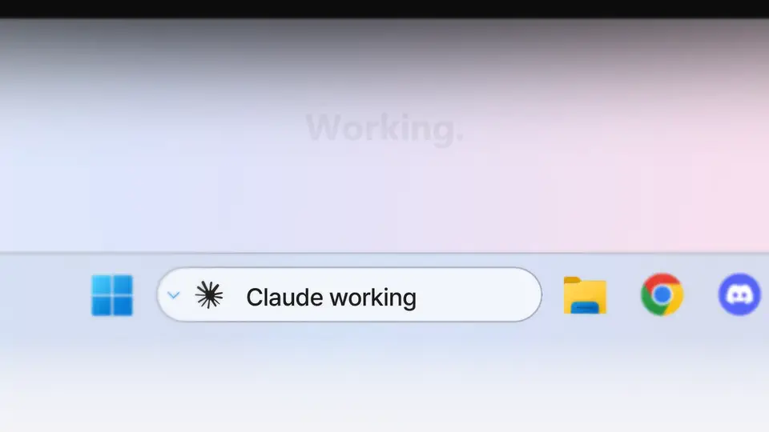</picture>
</p>

https://github.com/user-attachments/assets/9f25a46b-59fd-4983-947e-de8a450cfdd6

<p align="center">
  <a href="../../releases/latest"><b>⬇&nbsp;Download for Windows&nbsp;11</b></a>
  &nbsp;·&nbsp; <a href="https://ds3owl.github.io/islebar/">▶&nbsp;Watch the film</a>
  &nbsp;·&nbsp; <a href="#what-it-does">Features</a>
  &nbsp;·&nbsp; <a href="#install">Install</a>
</p>

<p align="center">
  
  
  
  
  
</p>

> [!TIP]
> **Works great with**
> - **[Claude Code](https://code.claude.com/docs/en/overview)** or **[Codex CLI](https://github.com/openai/codex)** — ask from the bar and see *working · needs you · done*.
> - **[Everything](https://www.voidtools.com/downloads/)** (voidtools, free) — press <kbd>Tab</kbd> to search every file on your PC instantly.
> - **Any web browser** — web search results open there.
>
> IsleBar runs on **Windows 11** (x64), with the taskbar search box shown as a box or an icon.

> [!NOTE]
> **This is an early version (0.1).** It is used daily on the author's PC, but your taskbar setup may differ. If something
> looks wrong, please [open an issue](../../issues/new/choose) — the installer version tells you on the bar when a fix is released.

IsleBar replaces the taskbar search box with a pill you can actually type into, and the pill itself becomes the status
display: an AI coding agent that is **working**, that **needs your answer** (orange), or that is **done** (green); the song
that is playing; a countdown; a download. It never floats a window over your screen for status — the pill stays exactly
where the search box already was, and only its *contents* change.

> **Unofficial and unaffiliated.** IsleBar is a hobby project. It is not made by, endorsed by, or connected to
> Anthropic PBC or OpenAI. "Claude" and "Claude Code" are
> trademarks of Anthropic PBC; "OpenAI" and "Codex" are trademarks of OpenAI. Glyphs come from *Segoe Fluent Icons*,
> which is part of Windows.

## What it does

### Ask Claude Code or Codex — from the taskbar

<p align="center"><picture><source media="(prefers-color-scheme: dark)" srcset="docs/media/ask-dark.webp">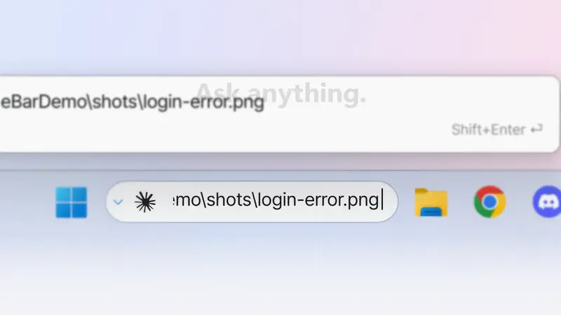</picture></p>

Click the pill (or press <kbd>Ctrl</kbd>+<kbd>Alt</kbd>+<kbd>C</kbd>), type what you want done, and press <kbd>Enter</kbd>.
A new terminal opens and runs Claude Code — or Codex — with your question, so you never have to open a terminal and
type the command yourself.

- <kbd>↑</kbd> / <kbd>↓</kbd> walk through your last 50 questions.
- Long questions get a wrapped preview above the bar, so you can read what you typed. <kbd>Shift</kbd>+<kbd>Enter</kbd>,
  or pasting several lines, opens a multi-line compose box.
- The ⌄ button holds the launch options you pinned: **session** (new · continue · resume), **model**, **effort**,
  **permissions** (auto · plan · ask · allow all) and **remote control**. A fresh install starts on *auto* permissions.

<p align="center"><picture><source media="(prefers-color-scheme: dark)" srcset="docs/media/options-dark.webp">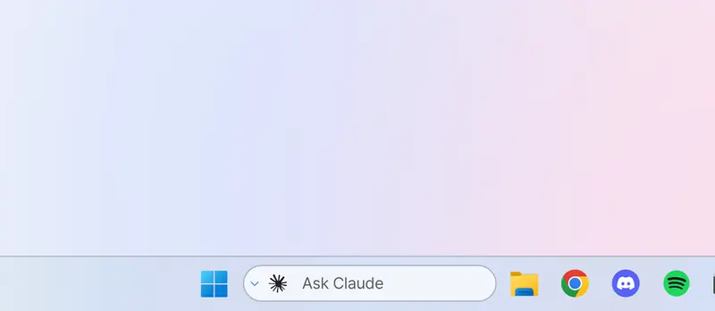</picture></p>

### Drop a file, then ask

<p align="center"><picture><source media="(prefers-color-scheme: dark)" srcset="docs/media/drop-dark.webp">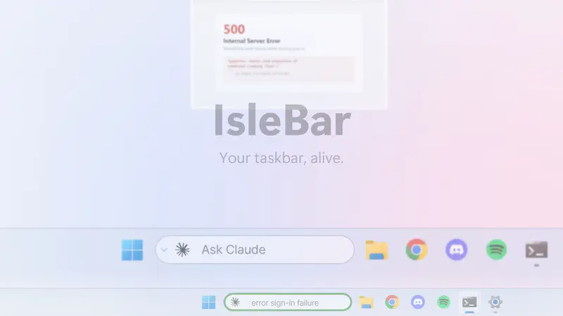</picture></p>

Drag a file onto the pill — a screenshot of an error, a log, a document — and its path goes straight into the box, ready for
your question. Type what you want, press <kbd>Enter</kbd>, and Claude Code or Codex opens it as part of the task.
Drop several at once if you like; the pill shows *Attach to prompt* while you hover.

**Or make it do something else.** In Settings › *Drop command*, give IsleBar any program or script and every file you drop
is handed to it instead (folders are zipped first). The pill shows *sending*, then *sent* or *failed*.

**How I use it:** my drop command is a small script of mine that sends whatever I drop to my phone over Telegram — I drop a
file on the taskbar and pick it up on my phone a few seconds later. That script isn't part of IsleBar; any command you like
works the same way.

### Working · needs you · done

<p align="center"><picture><source media="(prefers-color-scheme: dark)" srcset="docs/media/hero-dark.webp"></picture></p>

While the agent works, the pill shows **Claude working** and your question — so you can switch to something else and
still see, from the corner of your eye, where it is.

- **Orange border — it needs you.** The agent is asking for permission or has a question. Answer it in the terminal and
  the pill goes straight back to *working*.
- **Green border — it is done**, with a soft chime. It stays green until you look at that terminal, click the bar, or
  close the session, so you won't miss it after a coffee break.
- Running several sessions? The most urgent one is shown and a small dot tells you there is more; right-click lists them all.
- **Usage limits and failures.** When Claude Code or Codex hits its plan's usage limit, the pill says so in red with the time it
  resets ("Claude usage limit · resets at 18:59") and keeps it up until then. A turn stopped by another error (sign-in expired,
  billing, busy servers) shows why. And the first time a 5-hour or weekly window passes 90%, a short heads-up appears.
- The chime stays quiet during Do Not Disturb; Settings can also mute it while a game or video is full screen.
- This comes from hooks the installer adds to Claude Code and Codex — see [Claude Code and Codex](#claude-code-and-codex).

### Codex, too

<p align="center"><picture><source media="(prefers-color-scheme: dark)" srcset="docs/media/codex-dark.webp">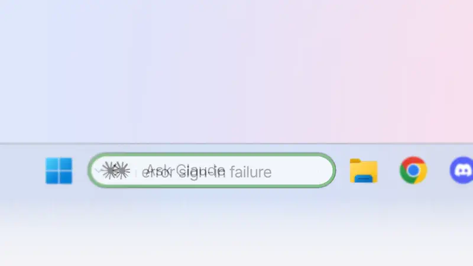</picture></p>

Codex CLI (0.15x and later) gets exactly the same *working · needs you · done*. The Codex mark is read from the Codex
extension already installed on your PC (VS Code, Cursor, Windsurf); IsleBar ships no OpenAI logo. Effort and remote
control are Claude-only options.

### Timers, pomodoro and a stopwatch

<p align="center"><picture><source media="(prefers-color-scheme: dark)" srcset="docs/media/timer-dark.webp">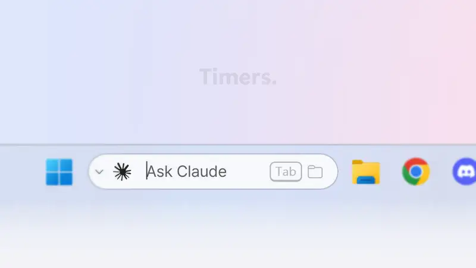</picture></p>

Type a duration and press <kbd>Enter</kbd> — `25m`, `90s`, `1h 30m`, `0.5m` (up to 24 hours). The pill counts down,
with only the digits that change rolling over.

- Hover the timer for ⏸ / ▶ and ✕. Starting a new one while another runs asks before replacing it.
- When it ends you hear the Windows notification sound and the pill turns green with *Timer done* for 10 seconds.
- Right-click the bar for quick timers (5 and 25 minutes by default, editable), **Pomodoro** (4 × 25 minutes of focus with
  5-minute breaks and a 15-minute long break, all adjustable) and a **Stopwatch**.

<p align="center"><picture><source media="(prefers-color-scheme: dark)" srcset="docs/media/menu-dark.webp"></picture></p>

### Find any file — instantly

<p align="center"><picture><source media="(prefers-color-scheme: dark)" srcset="docs/media/files-dark.webp">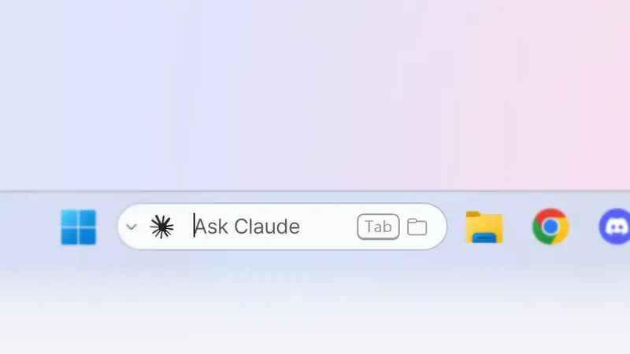</picture></p>

Press <kbd>Tab</kbd> to switch the bar to file search and start typing: the eight most recently changed matches appear
above the taskbar as you type, from every drive, powered by [Everything](https://www.voidtools.com/).

- <kbd>↑</kbd> / <kbd>↓</kbd> to choose, <kbd>Enter</kbd> to open, <kbd>Ctrl</kbd>+<kbd>Enter</kbd> to show it in File Explorer.
  <kbd>Esc</kbd> clears the box and takes you back to where you were.
- <kbd>Tab</kbd> again switches to **web search**, which opens your default browser with an engine that suits your
  language (Google, Bing, DuckDuckGo, NAVER, Daum, Yahoo! JAPAN, Baidu, Qwant, Ecosia… — you can pick one in settings).

<p align="center"><picture><source media="(prefers-color-scheme: dark)" srcset="docs/media/websearch-dark.webp">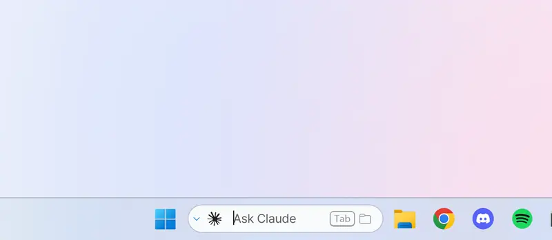</picture></p>

- Everything must be installed and running; if it isn't, the bar says so.

### Downloads

<p align="center"><picture><source media="(prefers-color-scheme: dark)" srcset="docs/media/downloads-dark.webp">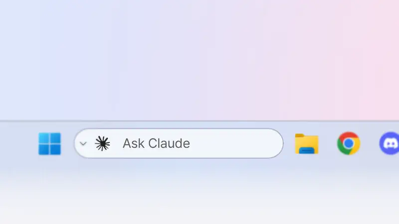</picture></p>

Downloads from Chrome, Edge, Firefox and other browsers show on the pill while they run, and *Done* with the file
name when they finish — click it to see the file in File Explorer. Transfers sent to the bar by scripts or the
`islebar` command (see [Feeding the isle](#feeding-the-isle)) also show the percentage and time left.

### Music

<p align="center"><picture><source media="(prefers-color-scheme: dark)" srcset="docs/media/music-dark.webp">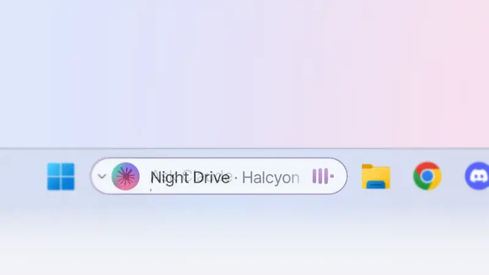</picture></p>

Whatever is playing through Windows' media controls — Spotify, YouTube in your browser and most music apps — shows
with its album art, level bars and a progress line tinted to the album's colour. Hover for ⏮ ⏯ ⏭. When an agent
finishes during a song, the green border lights up without hiding the music.

### Notices

<p align="center"><picture><source media="(prefers-color-scheme: dark)" srcset="docs/media/notices-dark.webp">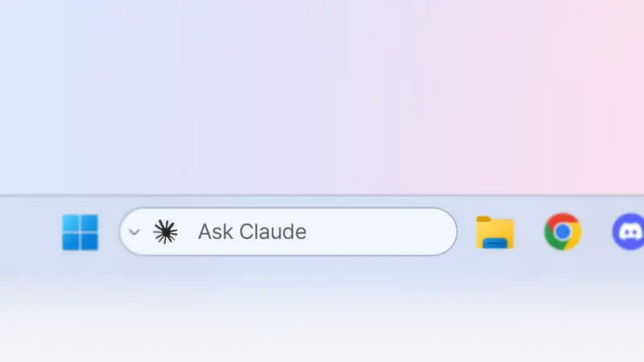</picture></p>

Short, quiet notices appear for a moment and then get out of the way — no pop-up windows:

| Notice | Shown |
|---|---|
| Charger plugged in / out | 2–3 seconds, with the battery level |
| **Low battery** (20% or less, not charging) | until you plug in — with a **red** border |
| Bluetooth device connected / disconnected | 2–3 seconds (with its battery, if it reports one) |
| Internet lost / back | 10 seconds / 2 seconds |
| Something copied (passwords are masked) | 1.5 seconds |
| CPU or memory under heavy load for 30 seconds | 10 seconds, with the busiest app |
| Focus session on | while it is on |
| Calendar event (from your ICS link) | counting down before it starts, and for a minute after |
| Microphone or camera in use | a moment, then a small orange dot while in use |

Colours mean the same everywhere: **orange** when an agent needs your answer, **red** when something needs fixing — a
low battery, or an agent stopped by its usage limit or an error — and **green** when something is done. Everything else
stays plain.

### Light and dark

<p align="center"><picture><source media="(prefers-color-scheme: dark)" srcset="docs/media/theme-dark.webp">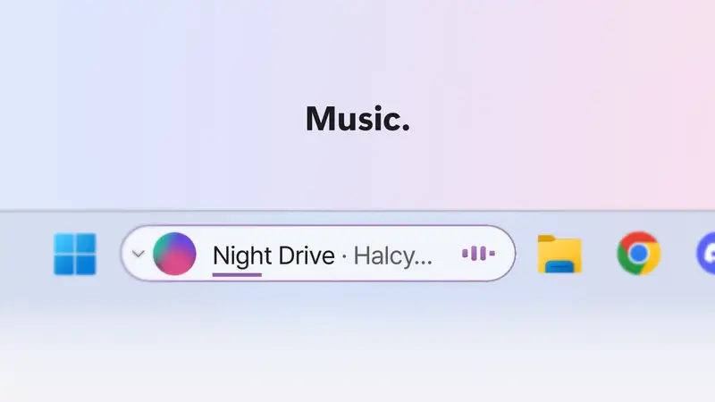</picture></p>

IsleBar follows your Windows theme and recolours itself the moment you switch — no restart.

### And a few more

- **Windows notifications on the isle** (off by default) — reads the local notification database and shows new messages
  on the pill.
- **Native mode** (off by default) — makes the real taskbar search box transparent from inside explorer, so it never shows
  through when taskbar icons shift. See [how it works](#native-mode--how-it-works).
- **Glass edge** — an optional light edge around the pill.

Motion uses spring curves: the pill squishes and springs back when something new arrives, old content blurs out before new content rises in, and timer digits roll only where they change.

Ten UI languages: English · 简体中文 · 繁體中文 · Français · Deutsch · Italiano · 日本語 · 한국어 · Português · Español.

## Install

1. Download `IsleBar-Setup-<version>.exe` and run it. It installs for your user only (no admin rights) into
   `%LOCALAPPDATA%\IsleBar`, and bundles everything it needs (.NET and the Windows App SDK).
2. Pick the options: **start IsleBar when I sign in**, and **connect Claude Code / Codex notifications** (see below).
3. The pill appears over the taskbar search box. Right-click it for timers and to close it; ⌄ opens launch options and ⚙ settings.

The installer and the app are **not code-signed yet**. Windows SmartScreen may say "Windows protected your PC" —
choose *More info → Run anyway*. On a PC with **Smart App Control** turned on, unsigned apps are blocked outright.

**Uninstall** from *Settings › Apps*. It stops the bar, gives the real search box back, restores any Windows
notification banners IsleBar had hidden, and removes only IsleBar's own hooks. Your settings stay in
`%LOCALAPPDATA%\IsleBar` in case you reinstall. *Microsoft Store version:* the Store gives apps no uninstall step, so
turn off **Claude Code / Codex connection** in IsleBar's settings before uninstalling — otherwise Claude Code and Codex
keep calling a command that is no longer there.

Requires Windows 11 (x64) with the taskbar search box shown as a box or icon.

## Claude Code and Codex

With the notifications option on, the installer adds hooks that call `islebar hook`:

| Agent | Where | What lights up |
|---|---|---|
| Claude Code | `~/.claude/settings.json` (`Notification`, `Stop`, `StopFailure`, `SessionEnd`, `UserPromptSubmit`, `PostToolUse`, `PostToolUseFailure`, and a `statusLine` if you have none — it shows "5h 42% \| 7d 17%" and is how the bar sees your plan usage) | working · needs you (orange) · done (green, with a chime) · usage limit / stopped (red) |
| Codex 0.15x+ | `~/.codex/hooks.json` (`UserPromptSubmit`, `PermissionRequest`, `PostToolUse`, `Stop`, `SessionEnd`) | the same |

Your other hooks are left alone, and `settings.json` is backed up first. **Codex asks you to trust new hooks once** —
the first time you start it after installing, choose *Trust all and continue* (or review them with `/hooks`).
A finished task stays green until you look at that terminal, click the bar, or close the session.

To connect or disconnect by hand: `installer\hooks.ps1 -Apply` / `-Revert`.

Launch options (⌄ and settings) choose session, model, effort, permissions and remote control. A fresh install
starts on **auto** permissions; "allow all" (`--dangerously-skip-permissions`) is there if you want it.

## Privacy

IsleBar runs entirely on your PC and sends nothing about you anywhere. The only network requests it makes on its own
are fetching Claude Code's model-alias list from `code.claude.com` (at start and every six hours), a daily check of
GitHub for a newer IsleBar (can be turned off; the setup is downloaded only when you choose to update) and, if you set
one, your calendar's ICS link (every 10 minutes). Web searches open in your browser.

**Crash reports are opt-in** (a setup checkbox, unticked by default, and a switch in settings). When on, a crash sends only
the error type, where in IsleBar's code it happened, the app and Windows versions and basic device info (processor,
memory, language/region format) — never window titles, files, paths, prompts, logs, names or your IP address. Details: [privacy policy](docs/privacy.html).

- *Windows notifications on the isle* (off by default) reads the local notification database to show messages on the pill.
- *Copied text* notices mask anything a password manager marks as secret, or that looks like a password.
- Logs stay in `%LOCALAPPDATA%\IsleBar\logs` (rotated).

## Layout

| Piece | What |
|---|---|
| `src/IsleBar.Core` | Platform-agnostic logic: settings, localization, argument building, isle state and selection, timers/pomodoro, spring curves, album tint, notice rules, ICS calendar parsing. Covered by unit tests (`tests/IsleBar.Core.Tests`). |
| `src/IsleBar.Cli` | `islebar push` / `islebar timer` / `islebar hook` — how other programs (and Claude Code / Codex hooks) feed the isle. |
| `src/IsleBar.App` | The WinUI 3 app (Windows App SDK 1.6). |
| `native/IsleBarTap` | Optional C++ module for native mode. A prebuilt `dist/IsleBarTap.dll` is included; `build.cmd` rebuilds it (Visual Studio 2022 Build Tools + Windows SDK 10.0.26100). |

## Building

```sh
dotnet test tests/IsleBar.Core.Tests   # Core tests — any OS
dotnet build src/IsleBar.App           # Windows 11 only
```

`run_dev.ps1 -Build` builds and starts the app through the signed `dotnet.exe` host
(useful when Smart App Control blocks unsigned executables).

## Native mode — how it works

Windows exposes a documented diagnostics channel for XAML apps (`InitializeXamlDiagnosticsEx`,
the one Visual Studio's Live Visual Tree uses). IsleBar uses it to load `IsleBarTap.dll` into
`explorer.exe`, find the taskbar's `SearchButtonControl`, and set its **opacity** to 0 — layout,
hit testing and accessibility are untouched, so the space stays reserved. The module restores the
search box when IsleBar exits (including crashes) or when the setting is turned off, and IsleBar
re-attaches it after explorer restarts. It is off by default.

## Feeding the isle

Either drop a UTF-8 JSON file into `%LOCALAPPDATA%\IsleBar\state\` (any `*.json` name), or into `%TEMP%\tgprog\` named
`tgprog_*.json`…

```json
{ "kind": "transfer", "title": "📥 phone → PC", "name": "holiday.mp4",
  "stage": "upload", "total": 81920000, "done": 4096000, "state": "run" }
```

…or let the CLI write it for you (one line, in PowerShell; the Store version also has it as plain `islebar`):

```powershell
& "$env:LOCALAPPDATA\IsleBar\bin\islebar.exe" push --id phone --kind transfer --title "📥 phone → PC" --name holiday.mp4 --total 81920000 --done 4096000 --state run
```

Give an `--id` and push again with the same id to update one pill (without it, every call adds a new one).
`islebar.exe help` lists all commands. Files that haven't been touched for two minutes are ignored, so a crashed
producer can't leave a stale pill behind. Windows PowerShell's `Out-File` writes UTF-16 — use
`Set-Content -Encoding UTF8` (or the CLI) for the JSON route.

## FAQ

**Is it free?** Yes — free and open source (MIT). No account, no ads.

**How do I get notified when Claude Code or Codex finishes on Windows?** Install IsleBar and connect Claude Code /
Codex (one checkbox in setup). The bar turns orange when the agent needs your answer and green with a soft chime when
it is done — no more watching the terminal.

**Do I need Claude Code or Codex?** Only for the AI part (asking from the bar and seeing *working · needs you · done*).
Music, timers, downloads, notices and web search work without them; file search needs [Everything](https://www.voidtools.com/).

**Windows says "Windows protected your PC".** The app isn't code-signed yet. Click *More info → Run anyway*.

**Does IsleBar collect or send anything?** Nothing about you leaves your PC. Crash reports are opt-in and contain only the
error, versions and basic device info — see [Privacy](#privacy).

**How do I get my normal search box back?** Right-click the bar → *Close search bar*, or uninstall from *Settings › Apps*.
Either way the Windows search box comes back.

**Which languages?** English, 简体中文, 繁體中文, Français, Deutsch, Italiano, 日本語, 한국어, Português, Español —
it follows your Windows language, or pick one in settings.

## Help, bugs and ideas

- **Something broken?** [Report a bug](../../issues/new?template=bug_report.yml) — say what you did and what happened.
  The log is at `%LOCALAPPDATA%\IsleBar\logs\islebar.log`; attaching it helps a lot, but look through it first —
  it can contain window titles and file names.
- **An idea?** [Suggest a feature](../../issues/new?template=feature_request.yml).
- **A question?** [Ask here](../../issues/new?template=question.yml) or in [Discussions](../../discussions) — first check the FAQ above.
- **No GitHub account?** Email [imchangwoo@outlook.com](mailto:imchangwoo@outlook.com).

Crash reports, if you turned them on, contain no personal data; anything else you share is your choice.

## Support IsleBar

IsleBar is free and stays free. If it saves you time, you can support its development through
[GitHub Sponsors](https://github.com/sponsors/ds3owl) — one-off or monthly. Bug reports, ideas and pull requests help just as much.

## Licence

Copyright (c) 2026 ds3owl. IsleBar is released under the **MIT License** — see [LICENSE](LICENSE).

Use it, change it, build on it, ship it — just keep the copyright and licence notice with your copy. If you make
something from it, a link back is appreciated, and fixes, ideas and feedback are very welcome here.
IsleBar comes with **no warranty** (see the licence). Third-party parts keep their own licences — see
[THIRD-PARTY-NOTICES.md](THIRD-PARTY-NOTICES.md).

---

## 한국어 요약

> [!TIP]
> **같이 쓰면 좋은 프로그램** — [**Claude Code**](https://code.claude.com/docs/en/overview) 또는 [**Codex CLI**](https://github.com/openai/codex)(바에서 질문하고 작업 중·답변 필요·완료 보기) ·
> [**Everything**](https://www.voidtools.com/downloads/)(voidtools, 무료 — <kbd>Tab</kbd>으로 PC의 모든 파일 바로 검색) · 웹 브라우저(웹 검색 결과). Windows 11(x64)에서 동작합니다.

**IsleBar**는 윈도우 11 작업표시줄의 검색창 자리에 들어가는 라이브 바입니다. 검색창에 그대로 입력하면 되고,
검색창 자체가 제자리에서 모양과 내용을 바꿔서 지금 하는 일을 보여 줍니다.

- **Claude·Codex에게 묻기** — 바를 클릭하거나 <kbd>Ctrl</kbd>+<kbd>Alt</kbd>+<kbd>C</kbd>, 질문을 치고 <kbd>Enter</kbd>. 긴 질문은 위에 전체가 보이고, <kbd>Shift</kbd>+<kbd>Enter</kbd>·여러 줄 붙여 넣기는 작성 창으로.
- **파일·웹 검색** — <kbd>Tab</kbd>으로 모드 전환(순서·켜고 끄기 설정). 빈 칸일 때 흐린 Tab 힌트.
- **섬** — 음악(앨범 색 막대·재생 바), 타이머·뽀모도로·스톱워치(우클릭 메뉴), 전송·다운로드, Claude·Codex 완료/답변 필요(초록/주황 테두리), 충전·블루투스·인터넷·집중·복사·과부하·일정 알림, 빨간 테두리는 손봐야 할 때(배터리 부족, 사용 한도·오류로 AI가 멈춤 — 초기화 시각 표시, 90%에서 미리 알림), 마이크·카메라 사용 중 주황 점.
- **끌어다 놓기** — 바에 파일을 놓으면 경로가 입력창에 들어가 그대로 질문할 수 있습니다. 설정에서 명령을 지정하면 다른 기능으로 바뀝니다. 제작자는 놓은 파일이 텔레그램으로 폰에 바로 가도록 직접 만든 스크립트를 연결해 씁니다.
- **선택 기능** — Windows 알림 끌어오기(기본 꺼짐), 네이티브 모드(진짜 검색창을 탐색기 안에서 투명하게, 기본 꺼짐), 빛 테두리.

> **비공식** 개인 프로젝트입니다. Anthropic·OpenAI와 아무 관련이 없습니다.
> "Claude"·"Claude Code"는 Anthropic PBC, "OpenAI"·"Codex"는 OpenAI의 상표입니다.

## Trademarks / 상표

- Claude and Claude Code are trademarks of Anthropic. The Claude icon shown in the bar is read at runtime from your own installed `claude.exe`; IsleBar does not ship it.
- OpenAI and Codex are trademarks of OpenAI. IsleBar ships no OpenAI logo — like the Claude icon, the Codex mark is read at runtime from your own installed Codex extension for VS Code/Cursor; without it a plain Windows glyph is used. IsleBar is not affiliated with or endorsed by OpenAI or Anthropic.
- Everything and the Everything SDK are by voidtools.
- Pretendard font by Kil Hyung-jin (orioncactus), bundled under the SIL Open Font License 1.1 — see `Assets/Fonts/Pretendard-OFL.txt`.

- Claude·Claude Code는 Anthropic의 상표입니다. 바의 Claude 아이콘은 사용자 PC에 설치된 `claude.exe`에서 실행 중에 읽어 오며, IsleBar는 이 그림을 싣지 않습니다.
- OpenAI·Codex는 OpenAI의 상표입니다. IsleBar는 OpenAI 로고를 싣지 않습니다. Claude 아이콘처럼 사용자 PC에 설치된 VS Code/Cursor용 Codex 확장에서 실행 중에 읽어 오고, 없으면 Windows 기본 아이콘을 씁니다.
